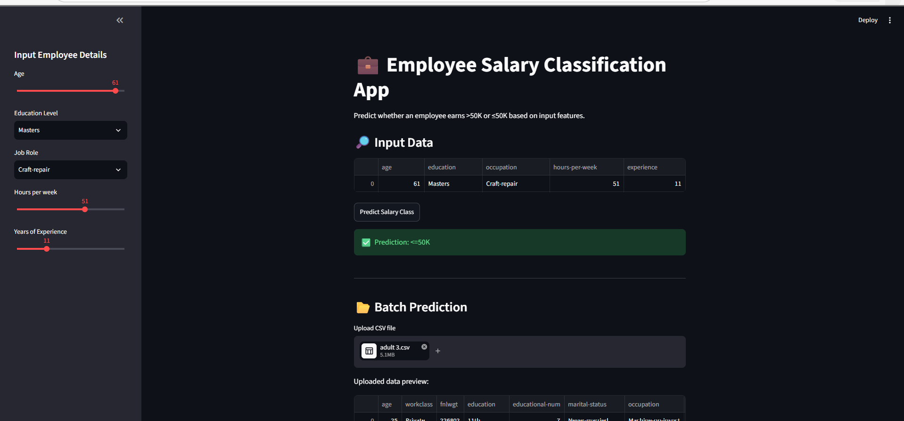
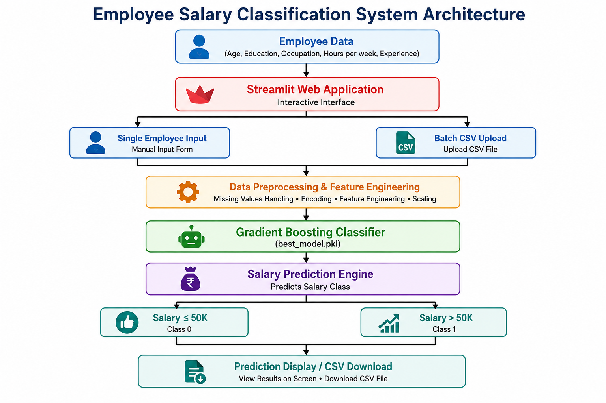

# 💼 Employee Salary Classification using Machine Learning


<p align="center">
  <b>An end-to-end Machine Learning application that predicts employee salary class using Gradient Boosting and Streamlit.</b>
</p>

<p align="center">


</p>

# 📌 Project Overview

The **Employee Salary Classification System** is a Machine Learning based application that predicts whether an employee earns:

* **≤ 50K salary**
* **> 50K salary**

based on various employee attributes such as age, education level, occupation, working hours, and experience.

The project includes complete ML workflow:

* Data preprocessing
* Feature engineering
* Model training
* Model evaluation
* Model deployment
* Interactive prediction interface
* Batch CSV prediction

# 🎯 Problem Statement

Organizations often require intelligent systems to analyze employee attributes and estimate salary categories.

This project builds a classification model that learns patterns from employee data and predicts salary classes using supervised machine learning techniques.

# 🚀 Features

## 🔹 Machine Learning Features

✅ Data preprocessing
✅ Categorical feature handling
✅ Feature transformation
✅ Gradient Boosting classification model
✅ Real-time prediction

## 🔹 Application Features

✅ Interactive Streamlit web application
✅ User-friendly input interface
✅ Single employee prediction
✅ Batch CSV file prediction
✅ Download prediction results
✅ Fast inference

# 🏗️ System Architecture

```
                 User Input
                     |
                     ↓
          Streamlit Web Application
                     |
                     ↓
          Data Preprocessing Layer
                     |
                     ↓
        Feature Engineering Pipeline
                     |
                     ↓
       Gradient Boosting Classifier
                     |
                     ↓
            Salary Classification
                     |
          ---------------------
          |                   |
       <=50K               >50K
```

# 🛠️ Technologies Used

## Programming Language

* Python

## Machine Learning

* Scikit-learn
* Gradient Boosting Classifier
* Pandas
* NumPy
* Joblib

## Application Development

* Streamlit

## Development Tools

* Jupyter Notebook
* VS Code
* Git & GitHub

# 📂 Project Structure

```
Employee-Salary-Classification-ML
│
├── app.py                         # Streamlit application
│
├── best_model.pkl                 # Trained ML model
│
├── requirements.txt               # Python dependencies
│
├── README.md                      # Project documentation
|___adult3.csv 
|                    #Dataset
├── images/
│   ├── app_screenshot.png
│   └── architecture.png
│
├── income_predicition.ipynb       # Model development notebook
│              
│
└── src/
    └── train.py                   # Training script
```

# ⚙️ Installation and Setup

## 1. Clone Repository

```bash
git clone https://github.com/Vineetha500/Employee-Pay-Scale-Estimator.git
```

## 2. Navigate into Project

```bash
cd Employee-Salary-Classification-ML
```

## 3. Create Virtual Environment

```bash
python -m venv venv
```

Activate environment:

### Windows

```bash
venv\Scripts\activate
```

### Linux / Mac

```bash
source venv/bin/activate
```

## 4. Install Dependencies

```bash
pip install -r requirements.txt
```

## 5. Run Application

```bash
streamlit run app.py
```

The application will open in your browser:

```
http://localhost:8501
```

# 📊 Machine Learning Model

## Algorithm Used

**Gradient Boosting Classifier**

## Type of Problem

Binary Classification

## Prediction Classes

| Class | Meaning     |
| ----- | ----------- |
| 0     | Salary ≤50K |
| 1     | Salary >50K |

# 🔄 Machine Learning Workflow

```
Dataset
   |
   ↓
Data Cleaning
   |
   ↓
Feature Selection
   |
   ↓
Categorical Encoding
   |
   ↓
Model Training
   |
   ↓
Model Evaluation
   |
   ↓
Model Saving (.pkl)
   |
   ↓
Streamlit Deployment
```

# 📸 Application Screenshots

## Employee Input Interface



## Architecture Diagram



# 📁 Input Features

| Feature        | Description               |
| -------------- | ------------------------- |
| Age            | Employee age              |
| Education      | Educational qualification |
| Occupation     | Job category              |
| Hours per week | Weekly working hours      |
| Experience     | Years of experience       |

=======
# Employee-Pay-Scale-Estimator
>>>>>>> dff44483abbfcca6e502b7f922f86bf7c4b30f62
